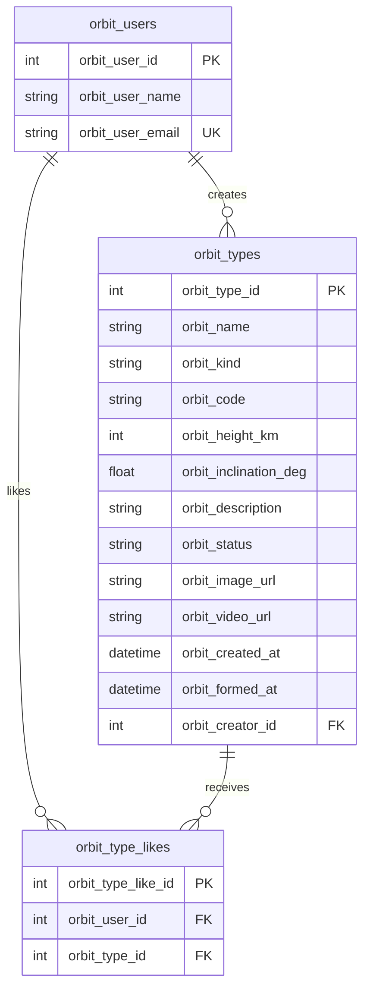

# Типы орбит: лабораторная 2

NestJS, PostgreSQL, TypeORM и Handlebars. Данные страниц хранятся в PostgreSQL. Лента, добавление и плитка используют три GET; создание черновика, публикация и логическое удаление используют три POST.

## Что сделать по шагам

1. Запустите Docker Desktop и дождитесь состояния `Engine running`. Работайте с отдельной базой этого проекта, а не с прежней базой на сайте.
2. Откройте терминал VS Code в корне проекта `C:\orbit-calculator-frontend`. Если зависимости еще не установлены, выполните `npm install`.
3. Выполните `docker compose up -d postgres adminer minio`. Это запускает PostgreSQL, Adminer и MinIO с медиа из первой лабораторной.
4. Выполните `npm run migrate`. Команда собирает NestJS и создает **только таблицы и ограничения**. Она не добавляет ни одной записи. `synchronize` не вызывается при обычном старте приложения.
5. Откройте http://localhost:8081. На странице входа Adminer выберите систему `PostgreSQL`, сервер `postgres`, пользователь `orbit_user`, пароль `orbit_password`, базу `orbit_calculator`.
6. Убедитесь, что появились таблицы `orbit_users`, `orbit_types`, `orbit_type_likes`. Если они уже заполнены данными от прежней версии лабораторной, не выполняйте начальный SQL повторно: используйте отдельный файл `sql/lab2-restore-existing-media.sql` для ручного восстановления URL и третьей опубликованной карточки.
7. Для **пустой БД** в Adminer нажмите `SQL-команда`, откройте файл `sql/lab2-manual-data.sql`, вставьте его содержимое в поле запроса и нажмите `Выполнить`. Это ручное заполнение через Adminer, как в методичке. Файл добавляет пять пользователей, три опубликованные орбиты с исходными URL MinIO, один черновик, одну удаленную орбиту и девять лайков. Выполняйте его только один раз.
8. В Adminer выполните проверочные `SELECT` из раздела ниже. У пользователя `Автор` должен быть `orbit_user_id = 1`: это фиксированный пользователь текущей лабораторной в коде.
9. В терминале выполните `npm run start:dev` и откройте http://localhost:3000. Терминал с сервером оставьте открытым.
10. Проверьте три страницы: ленту, добавление и плитку. После ручного заполнения черновик уже существует, поэтому страница добавления сразу покажет его поля и кнопку `Опубликовать`. После публикации следующий вход на эту страницу покажет пустой первый шаг. Фото и видео выбирать необязательно: без них можно нажать `Далее`, а приложение покажет локальные медиа по умолчанию. При нажатии `Далее` черновик записывается в БД, второй шаг открывается без перезагрузки и выбранные файлы остаются видны в форме. После обновления страницы локальные файлы повторно выбрать придется: по заданию они не передаются на сервер и не сохраняются в БД.

Настройки подключения по умолчанию совпадают с `.env.example`; `.env` нужен только при изменении параметров Docker. Для исходных фото и видео нужен запущенный MinIO и бакет `orbit-media` с объектами `image/astra-1.png`, `image/meteor-2.png`, `image/geosat-1.png`, `image/sfera.png` и одноименными роликами в `videos/` с расширением `.mp4`. Проверьте их в консоли http://localhost:9001. Если объекта или доступа к нему нет, браузер покажет медиа по умолчанию из `public/media` (видео из [NASA SVS Earthrise](https://svs.gsfc.nasa.gov/4593)).

## Схема данных



Каскадного удаления нет. Частичный уникальный индекс разрешает пользователю не более одного черновика, а составной уникальный индекс запрещает повторный лайк одного типа орбиты одним пользователем.

Для ER-диаграммы в StarUML укажите типы и длины: `orbit_users` — `orbit_user_id` integer PK, `orbit_user_name` varchar(80), `orbit_user_email` varchar(120) UNIQUE; `orbit_types` — `orbit_type_id` integer PK, `orbit_name` varchar(120), `orbit_kind` varchar(80), `orbit_code` varchar(12), `orbit_height_km` integer, `orbit_inclination_deg` real, `orbit_description` text, `orbit_status` varchar(20), `orbit_image_url` и `orbit_video_url` varchar(500) NULL, `orbit_created_at` timestamptz, `orbit_formed_at` timestamptz NULL, `orbit_creator_id` integer FK; `orbit_type_likes` — `orbit_type_like_id` integer PK, `orbit_user_id` integer FK, `orbit_type_id` integer FK. Связи: пользователь 1:N типы орбит, пользователь 1:N лайки, тип орбиты 1:N лайки.

## Проверка в Adminer

После ручного заполнения выполните:

```sql
SELECT orbit_user_id, orbit_user_name FROM orbit_users ORDER BY orbit_user_id;

SELECT orbit_type_id, orbit_name, orbit_status,
       orbit_height_km, orbit_inclination_deg, orbit_creator_id
FROM orbit_types
ORDER BY orbit_type_id;

SELECT orbit_type_id, COUNT(*) AS like_count
FROM orbit_type_likes
GROUP BY orbit_type_id
ORDER BY orbit_type_id;
```

Для защиты по [заданию лабораторной 2](https://github.com/iu5git/Web#лабораторная-2): сначала покажите Adminer, `SELECT` и ручное изменение статуса орбиты на `Удален`; затем три страницы приложения, поиск по высоте, удаление через кнопку и 404 по прежнему URL (`/?id=...`). Покажите `SELECT` после удаления, публикации черновика и создания новой карточки. В Adminer измените высоту или наклонение опубликованной записи и добавьте/удалите строку в `orbit_type_likes`, затем обновите страницы и покажите изменения. Отдельно покажите модели, ORM-методы, SQL `UPDATE`, локальные медиа по умолчанию и ER-диаграмму в StarUML. По требованиям курса подготовьте пронумерованные скриншоты для отчета и ответы на контрольные вопросы.
